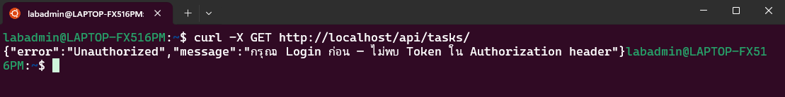
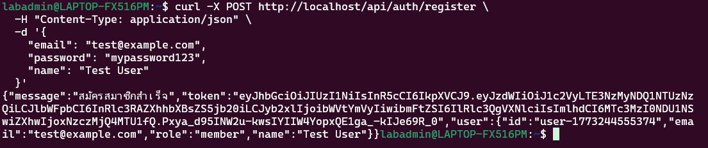
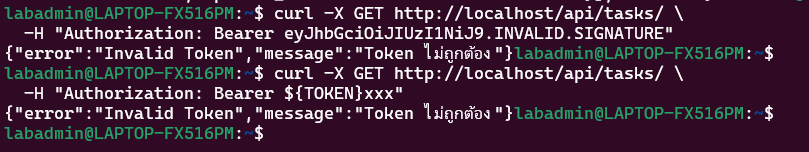
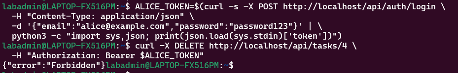
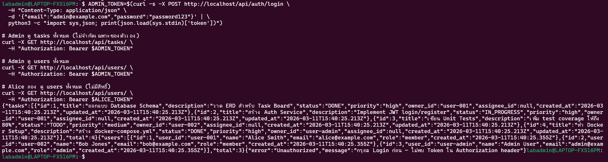
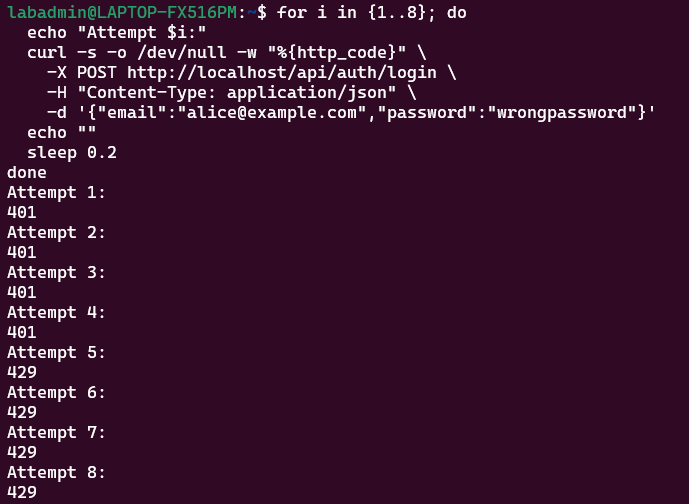
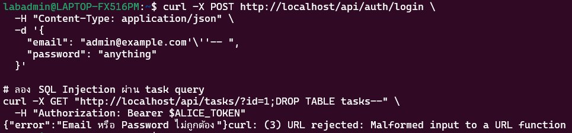

# ใบงาน Week 12: Security Architecture Analysis

## บันทึกผลการทดสอบ

### Test Case 1: ❌ เรียก Protected API โดยไม่มี Token
**บันทึกผลการทดสอบ:**
- **Status Code ที่ได้:** 401 Unauthorized
- **เป็นไปตามที่คาดหวังหรือไม่:** เป็นไปตามที่คาดหวัง
- **เพราะเหตุใด:** เพราะ API Gateway และ Task Service มีการตั้งค่า JWT Middleware (`requireAuth`) ไว้ หากไม่มี Token ใน Authorization header จะถูกปฏิเสธการเข้าถึงพร้อมข้อความ "กรุณา Login ก่อน"

---

### Test Case 2: ✅ Register และ Login เพื่อรับ Token

---

### Test Case 3: ✅ เรียก Protected API ด้วย Token
**บันทึกผลการทดสอบ:** 
- **จำนวน tasks ที่ได้:** 2
- **Tasks แสดงเฉพาะของ alice หรือทั้งหมด:** เฉพาะของ alice (user-001)
- **เพราะเหตุใด:** เนื่องจาก API ระดับ Backend (`tasks.js`) มีการนำ JWT Claim (Sub หรืออ้างอิง user_id) มา Query ในฐานข้อมูล (`SELECT * FROM tasks WHERE owner_id = $1...`) ทำให้เมื่อเป็นแค่ Member จึงสามารถดึงและเห็นเฉพาะ Task ที่ตัวเองเป็นเจ้าของเท่านั้น

---

### Test Case 4: ❌ ใช้ Token ที่หมดอายุหรือ Invalid
**บันทึกผลการทดสอบ:** 
- **ทั้ง 2 กรณีให้ผลอย่างไร:** Server ปฏิเสธการเข้าถึงและเกิด HTTP Error `401 Invalid Token` (ข้อความ: Token ไม่ถูกต้อง)
- **JWT Signature ทำงานอย่างไร:** JWT Signature ชิ้นสุดท้าย (แยกด้วย `.`) เกิดจากการนำ Header และ Payload มาเข้ารหัส HMAC-SHA256 ด้วย Secret Key ที่ตั้งไว้เฉพาะฝั่ง Server หากข้อมูลถูกเปลี่ยนไปในระดับ Client (หน้าบ้าน) เมื่อแนบมาให้ Server เช็ค ก็จะได้ค่า Signature ไม่ตรงกัน ส่งผลให้ API ไม่อนุญาตให้ผ่าน

---

### Test Case 5: ❌ Authorization — Member ลบ Task ของคนอื่น
**บันทึกผลการทดสอบ:** 
- **ผลที่ได้:** เกิด Error `403 Forbidden`
- **Authentication vs Authorization ต่างกันอย่างไรในกรณีนี้:** 
  - **Authentication** (การยืนยันตัวตน): Alice ล็อกอินเข้ามามีตัวตนจริง, มี Token ที่ Valid (ผ่านด่าน 401)
  - **Authorization** (การตรวจสอบสิทธิการเข้าถึง): Alice ระดับเป็นแค่ "Member" ไม่ใช่ "Admin" และไม่ได้เป็น Owner ของ Task id=4 ดังนั้นสิทธิไม่เพียงพอ (ติดด่าน 403 Forbidden)

---

### Test Case 6: ✅ Admin ทำได้ทุกอย่าง
**บันทึกผลการทดสอบ:** 
- **Admin เห็น tasks กี่รายการ:** เห็นแบบครบถ้วน จำนวน 4 รายการ
- **Alice เห็น tasks กี่รายการ:** เห็นเพียง 2 รายการ (ของตัวเอง)
- **Alice เรียก `/api/users/` ได้ status:** 403 Forbidden 
- **สรุป Role-Based Access Control ทำงานอย่างไร:** สิทธิ์ของผู้ใช้จะถูกฝังอยู่ใน Payload ของ JWT Token (Role Claim) เมื่อเรียก API Middleware จะตรวจว่า Role ตรงกับที่อนุญาตหรือไม่ (เช่น requireRole('admin')) หากตรงก็จะข้ามไป Query แบบทั้งหมดได้ทันที หรือถูกสั่งปฏิเสธหากไม่ใช่แอดมิน

---

### Test Case 7: ❌ Brute-force Attack (Rate Limiting)
**บันทึกผลการทดสอบ:** 
- **Attempt ที่เท่าไหร่ที่เริ่มได้ 429:** Attempt ที่ 5 (ครั้งที่ 1-4 ขึ้น 401 รหัสผ่านผิด)
- **Rate Limiting ช่วยป้องกัน Attack ชนิดใด:** ช่วยกันการโจมตีประเภท Brute-force (สุ่มเดารหัสผ่าน) หรือการยิง DoS ขอเข้าสู่ระบบอย่างหนักหน่วงจน Server หรือ DB ล่ม
- **ข้อเสียของ Rate Limiting ที่อาจเกิดขึ้น:** การบล็อคตามระดับ Public IP ของแบนด์วิทรวม อาจไปส่งผลกระทบให้ผู้บริสุทธิ์จำนวนมากที่แชร์ IP NAT เดียวกันในองค์กรใช้งานอินเตอร์เน็ตในระบบไม่ได้ชั่วคราว (False Positive) 

---

### Test Case 8: 🔍 SQL Injection Attempt
**บันทึกผลการทดสอบ:** 
- **ได้ผลลัพธ์อย่างไร:** การล็อกอินคืนค่าว่า Email / Password ผิด (`401`) และไม่มีส่วนใดในระบบเสียหาย 
- **Parameterized Query ป้องกัน SQL Injection อย่างไร:** 
   ใน Node.js (`pg`) โค้ดจะใช้ Parameterized string เช่น `pool.query('SELECT * ... WHERE email = $1', [email])` ทำให้ตัวแปรถูกมองเป็น Values ไม่ได้นำเอาไปต่อ string กับคำสั่ง SQL Database จึงมั่นใจได้ว่าสิ่งที่ถูกส่งเข้ามาไม่สามารถ Execute ทะลุเข้าช่องโหว่ได้

---

## สรุปผลการทดสอบ

| Test Case | Expected | Actual | ✅/❌ | หมายเหตุ |
|-----------|----------|--------|------|---------|
| 1. ไม่มี Token | 401 | 401 | ✅ | ทำงานได้ถูกต้อง ถูกปฏิเสธตั้งแต่ API Gateway/Middleware |
| 2. Login สำเร็จ | 200 + Token | 200 + Token | ✅ | ล็อกอินผ่านและแจก JWT Token ให้ |
| 3. มี Token ถูกต้อง | 200 + data | 200 + data | ✅ | ตอบกลับรายการ Tasks ได้เฉพาะของ User ตัวเอง |
| 4. Token Invalid | 401 | 401 | ✅ | ระบบเช็ค Digital Signature ผิดปกติ หรือเปลี่ยน Format |
| 5. Forbidden (403) | 403 | 403 | ✅ | ระบบกั้นไม่ให้สมาชิกอื่นๆ จัดการข้อมูลของผู้อื่น |
| 6. Admin access | 200 | 200 | ✅ | Admin รับสิทธิข้าม Owner เข้าถึงข้อมูลได้ทั้งหมด |
| 7. Rate Limit | 429 | 429 | ✅ | API Gateway Nginx สกัดจับได้ตาม Zone ที่จำกัด Rate ไว้ |
| 8. SQL Injection | Safe | Safe | ✅ | โครงสร้าง Database ปลอดภัยด้วยการใช้ Parameterized Queries |
